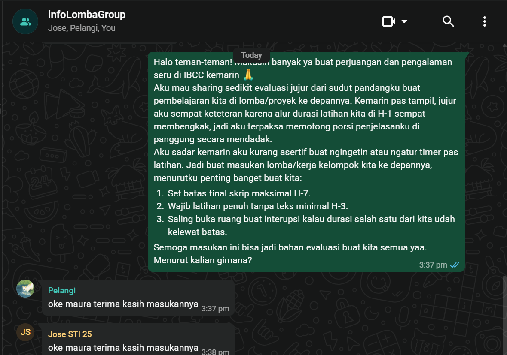

## Kompetensi target

Memisahkan event, fact, story, emotion, internal character, choice, dan action.

## **Bagian 1: Identifikasi Kasus (Bahan Mentah)**

Pilihlah satu peristiwa sulit, menantang, atau kurang menyenangkan yang baru-baru ini Anda alami (misalnya: pesan tidak dibalas, kritik dari dosen, tugas kelompok terhambat, atau rencana yang batal) \[11, 13\]. *Catatan Etis: Pilih kasus yang cukup aman untuk dipelajari secara akademis. Jangan memilih situasi kekerasan atau trauma berat yang membutuhkan bantuan profesional \[13\].*

### **1. Peristiwa yang Dapat Diamati (Fakta Objektif)**

*Tuliskan apa yang benar-benar terjadi tanpa penilaian karakter, generalisasi (hindari kata "selalu" atau "pasti"), atau dugaan niat. Bayangkan apa yang terekam oleh kamera video \[13, 145\].* \> **Contoh Kurang Tepat:** *"Rekan kelompok saya malas dan sengaja mengabaikan tugas kelompok."*\
\> **Contoh Tepat:** *"Dua tugas yang disepakati di WhatsApp grup belum dikirimkan oleh Rekan X hingga batas waktu tanggal 30 Agustus pukul 23.59."* \* 
**Tuliskan Fakta Anda di sini:** Sabtu, 12 September 2026 kemarin aku mengikuti lomba IBCC di Jogja. Di dalam lomba itu aku harus melakukan presentasi dalam bahasa inggris. Selama presentasi aku sempat berhenti beberapa kali dan mencari kosakata. Presentasi tetap selesai tepat waktu, namun poin yang ingin aku sampaikan tidak sepenuhnya tersampaikan dengan baik.  

### **2. Interpretasi Pertama (Asumsi Otomatis)**

*Tuliskan pemikiran atau kesimpulan pertama yang langsung melompat di kepala Anda ketika peristiwa itu terjadi \[13, 145\].* \* 
**Tuliskan Interpretasi Pertama Anda di sini:** Aku langsung merasa bahwa aku sangat amat tidak pantas ada di panggung itu dan seharusnya aku melakukan persiapan yang lebih matang lagi. Namun memang, situasinya pada saat itu aku sedang beradaptasi dengan jadwal kuliah yang baru dan juga karena aku baru saja menyelesaikan salah satu kaderisasi sehingga waktu yang tersedia memang terbatas.
Di balik asumsi ini, muncul dua Karakter Internal (Internal Character):
1. Penghindar Konflik: Suara batin yang memilih diam saat latihan tidak efektif karena takut merusak suasana atau dianggap dominan/sok mengatur oleh teman-teman.
2. Berkorban Diam-Diam: Suara batin yang memilih mengalah dan memotong porsi presentasi pribadi di saat-saat terakhir demi menutupi keterlambatan durasi tim, lalu menanggung rasa kecewa dan kegagalan itu sendirian tanpa menyuarakan keberatan secara terbuka. 

### **3. Emosi & Sensasi Tubuh**

*Identifikasi emosi konkret yang Anda rasakan (marah, cemas, malu, kecewa, sedih) dan tandai intensitasnya dari skala 0–10. Catat juga reaksi fisik yang Anda rasakan (napas pendek, rahang menegang, dada sesak) \[13, 147\].* \* **Emosi yang Dirasakan (dan skala 0-10):** Kecewa. 10/10. 
**Sensasi Tubuh yang Muncul:** Reaksi fisik yang aku rasakan adalah jantung yang berdebar karena aku merasa sudah gagal menyampaikan apa yang seharusnya aku sampaikan 

------------------------------------------------------------------------

## **Bagian 2: Membedah Tiga Narasi**

Kini, mari kita bawa peristiwa di atas ke dalam tiga kacamata cerita batin yang berbeda untuk melihat bagaimana narasi tersebut mengarahkan pilihan hidup Anda \[13, 157\].

```         
+---------------------------------------------------------------------------------+
|                                 TIGA KACAMATA                                   |
|                                                                                 |
|  1. NARASI KORBAN          2. NARASI ANALITIS          3. NARASI PERTUMBUHAN    |
|  "Semua kendali di luar    "Membedah fakta,            "Mengakui kesulitan,     |
|  diri saya, saya lumpuh    asumsi, dan hal yang        menemukan pelajaran,     |
|  tanpa pilihan tindakan."  bisa saya kendalikan."      dan bertindak."          |
+---------------------------------------------------------------------------------+
```

### **Versi A: Narasi Korban (Victim Narrative)**

*Tempatkan diri Anda sepenuhnya sebagai korban keadaan. Tuliskan narasi di mana semua kendali berada di luar diri Anda, orang lain sepenuhnya bersalah, dan Anda tidak memiliki pilihan selain pasrah, menyalahkan diri sendiri, atau membalas secara pasif \[13, 157\].* \* **Isi Narasi Korban Anda:** 
Seharusnya orang lain bisa meluangkan waktu lebih banyak lagi untuk bisa latihan bersama tanpa baca teks supaya saat presentasi tidak melebihi waktu yang seharusnya. aku sudah menyiapkan skrip ku juga, tapi aku harus memotong durasinya dan narasi yang aku sampaikan karena kalian semua tidak berlatih tanpa teks sehingga waktunya yang kalian gunakan melebihi yang seharusnya.
 **Pilihan Tindakan Otomatis (Reaktif) dari Narasi ini:** *(Contoh: mendiamkan balik, keluar grup proyek tanpa kabar, atau mengeluh di media sosial)* 
 Mendiamkan rekan tim ku karena rasa kecewa, aku juga takut marah marah tidak jelas di depan mereka tanpa menyusun poin penyampaian dengan lebih jelas.

### **Versi B: Narasi Analitis (Analytical Narrative)**

*Gunakan kacamata yang objektif dan rasional. Pisahkan dengan tegas antara fakta yang diketahui, hal-hal yang masih berupa dugaan (belum diketahui), serta faktor-faktor yang berada di bawah kendali Anda langsung \[13, 157, 158\].* \* **Apa fakta yang benar-benar telah terbukti?** Kami telah berlatih bersama sebanyak 3 kali. Namun, pada H-1 lomba, dua rekan tim masih menggunakan teks saat latihan sehingga durasi bagian mereka membengkak. Akibatnya, aku memutuskan memotong sebagian isi materi bagianku saat tampil agar total waktu tim tidak melewati batas maksimal. **Bagaimana Dinamika Kekuasaan (Power Dynamics) & Peran Diri dalam Situasi Ini?** 1. Ketiadaan Struktur Kepemimpinan: Dalam tim ini tidak ada penanggung jawab koordinasi yang jelas. Aku memilih memposisikan diri sebagai anggota pasif dan enggan mengambil peran kepemimpinan untuk mengarahkan alur latihan. Kepasifan Kolektif: Saat melihat latihan tidak efektif, karakter Conflict Avoider membuatku enggan mengeksekusi kendali (misal: menegur, menghentikan latihan teks, atau menetapkan timer tegas). Akibatnya, dinamika kekuasaan tim dikendalikan oleh ketidaksiapan anggota lain, sementara aku menyerahkan kendali atas alokasi waktuku sendiri. **Apa penjelasan lain (alternatif asumsi) yang masuk akal namun belum saya periksa?** Selain faktor kesibukan masing-masing (kuliah baru dan kaderisasi), rekan tim mungkin mengalami kecemasan tinggi karena ini lomba pertama mereka. Sikap mereka yang bertahan membaca teks adalah bentuk coping mechanism atas rasa gugup, bukan sengaja ingin mengabaikan tugas. Ketidakjelasan komunikasi terjadi karena tidak ada kesepakatan norma kerja (working agreement) sejak awal. **Faktor apa dalam situasi ini yang berada di bawah kendali saya langsung?** Keberanian saya untuk mengekspresikan kendala secara asertif; Keputusan untuk mengambil peran pembawa pengaruh (influence/leadership) saat terjadi krisis waktu; Cara saya merespons keterbatasan waktu (menegosiasikan pemotongan skrip secara transparan bersama tim, bukan menanggungnya sendirian secara sepihak). 

### **Versi C: Narasi Pertumbuhan (Growth Narrative)**

*Gunakan kacamata belas kasih (*compassion*) dan pola pikir bertumbuh (*growth mindset*). Akui bahwa situasinya sulit dan emosi Anda valid, namun arahkan batin Anda untuk menemukan hikmah/pelajaran serta memilih tindakan yang selaras dengan nilai jangka panjang Anda \[13, 151, 157\].* \* **Isi Narasi Pertumbuhan Anda:** Situasi lomba dan penyesuaian jadwal kuliah memang menantang, dan rasa kecewaku adalah emosi yang valid. Namun, aku menyadari bahwa memelihara karakter Conflict Avoider demi harmoni semu justru merugikan diriku dan performa tim secara keseluruhan. Aku memilih bertransformasi dari Passive Observer menjadi 'Assertive Facilitator' yaitu sosok yang berani mengambil inisiatif kepemimpinan dan menyuarakan hal penting demi kebaikan bersama. **Pelajaran apa yang dapat saya ambil dari situasi ini?** Pelajaran Kepemimpinan & Komunikasi: Harmoni tim yang sehat bukan dibangun dari menghindari ketegangan, melainkan dari keterbukaan, akuntabilitas, dan kejelasan batasan.

Simulasi Mental / Replay Situasi Krisis:
> Skenario Simulasi: Jika situasi latihan H-3 berulang, aku akan berani menginterupsi latihan secara sopan namun tegas: "Teman-teman, kalau kita terus latihan baca teks, durasi total kita melampaui batas dan materi penting di akhir akan terpotong. Mari kita sepakati simulasi tanpa teks sekarang, walau masih patah-patah, agar kita tahu alokasi waktu sebenarnya."
> Perlawanan Internal yang Diantisipasi: Rasa cemas dianggap sok mengatur atau merusak suasana. Cara Mengatasi: Menyadari bahwa ketegasan ini adalah bentuk kepedulian (care) pada keberhasilan seluruh tim, bukan bentuk dominasi pribadi.
> Perlawanan Eksternal yang Diantisipasi: Keberatan atau ketidaknyamanan dari rekan tim. Cara Mengatasi: Memvalidasi kecemasan mereka sambil menawarkan bantuan ("Aku tahu ini membuat deg-degan, tapi mari coba bersama dulu").

------------------------------------------------------------------------

## **Bagian 3: Merancang Respons (Action & Support)**

### **1. Pilihan Respons Terbaik**

*Berdasarkan Narasi Pertumbuhan Anda, tuliskan tindakan kecil, konkret, dan asertif yang akan Anda lakukan sekarang untuk merespons situasi tersebut \[13, 157, 158\].* \* **Langkah nyata yang saya pilih:** 
1. Menjadwalkan sesi evaluasi singkat bersama tim lomba  untuk mendiskusikan lesson learned secara terbuka tanpa saling menyalahkan.
2. Memprakarsai pembentukan Working Agreement (termasuk batas waktu penetapan skrip H-7 dan simulasi tanpa teks H-3) untuk proyek/kompetisi mendatang.
3. Melatih keterampilan komunikasi asertif ketika menjumpai alokasi waktu yang tidak seimbang dalam kerja kelompok.

### **2. Dukungan yang Diperlukan**

*Siapa orang tepercaya (teman, keluarga, dosen) yang dapat Anda mintai umpan balik jujur atau bantuan untuk mendampingi Anda menjalankan pilihan ini? \[13, 158\]* \* **Nama rekan/pendamping:** Ibu 

### **3. internal agreement**
| Elemen | Isi |
|---|---|
| **Tindakan** | Menulis refleksi 1 halaman tentang: pelajaran dari lomba IBCC, analisis karakter internal (Conflict Avoider vs Assertive Facilitator), serta strategi kepemimpinan tim untuk presentasi berikutnya. |
| **Batas waktu** | Minggu, 27 September 2026 |
| **Indikator keberhasilan** | Refleksi selesai ditulis, disimpan, dan menghasilkan minimal 3 poin aksi kepemimpinan yang terukur. |
| **Konsekuensi jika tidak dilakukan** | Menyisihkan waktu khusus 30 menit tanpa gawai di hari Senin untuk menyelesaikan refleksi. |

### **4. Bukti Tindakan**

**Tanggal:** 27 September 2026
**Tindakan:** Menulis refleksi 1 halaman

**Isi refleksi (ringkasan):**
- Kegugupan dan kendala durasi bukan semata-mata karena kemampuan bahasa Inggris, melainkan karena ketiadaan kepemimpinan koordinasi dan norma tim yang tegas sejak awal.
- Saya mengidentifikasi kecenderungan batin saya sebagai Conflict Avoider dan Silent Sacrificed yang memilih mengalah diam-diam daripada membangun komunikasi asertif.
- Untuk presentasi/lomba berikutnya, saya berkomitmen mengambil peran Assertive Facilitator: menyepakati jadwal ketat (skrip selesai H-7, simulasi tanpa teks H-3 minimal 3x), serta berani melakukan intervensi konstruktif saat latihan tidak efektif.

**Bukti:** 

**Refleksi setelah menulis:**
Dengan menulis refleksi ini, saya menyadari bahwa masalah utama bukan sekadar kesibukan anggota tim, melainkan bagaimana saya memposisikan diri dalam dinamika kekuasaan tim. Saya merasa lebih lega dan berdaya setelah memahami bahwa kendali kepemimpinan ada di tangan saya.


------------------------------------------------------------------------

## Evidence wajib

- Satu episode komunikasi dengan diri sendiri.
- Initial story dan sedikitnya dua alternative narratives.
- Internal agreement dan bukti tindakan berikutnya.

## Penggunaan AI dalam Proses Ini

| Aspek | Keterangan |
|---|---|
| **Bagian yang dibantu AI** | Format internal agreement, struktur bukti tindakan, dan kerangka analisis internal character & power dynamics. |
| **Prompt yang digunakan** | "Contoh analisis internal character dan power dynamics dalam jurnal refleksi pasca-lomba serta format internal agreement" |
| **Hasil dari AI** | Template tabel internal agreement dan usulan sudut pandang dinamika kekuasaan dalam kerja tim. |
| **Modifikasi yang saya lakukan** | Saya menyesuaikan seluruh analisis dengan pengalaman nyata lomba IBCC di Jogja, merefleksikan karakter batin (Conflict Avoider), serta menyusun simulasi mental (replay) pribadi. |
| **Bagian yang murni saya sendiri** | Fakta objektif kejadian, emosi & sensasi fisik, narasi pribadi, dan seluruh refleksi pasca-tindakan. |

::: {.callout-tip title="Lihat contoh pengisian"}
[Buka contoh fiktif Minggu 2](../examples/week-02.qmd) untuk melihat tingkat kekonkretan evidence dan analisis. Jangan menyalin contoh sebagai evidence pribadi.
:::


